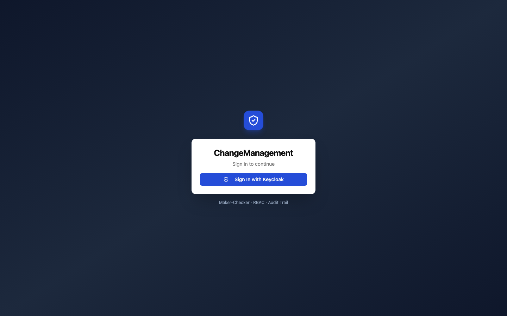
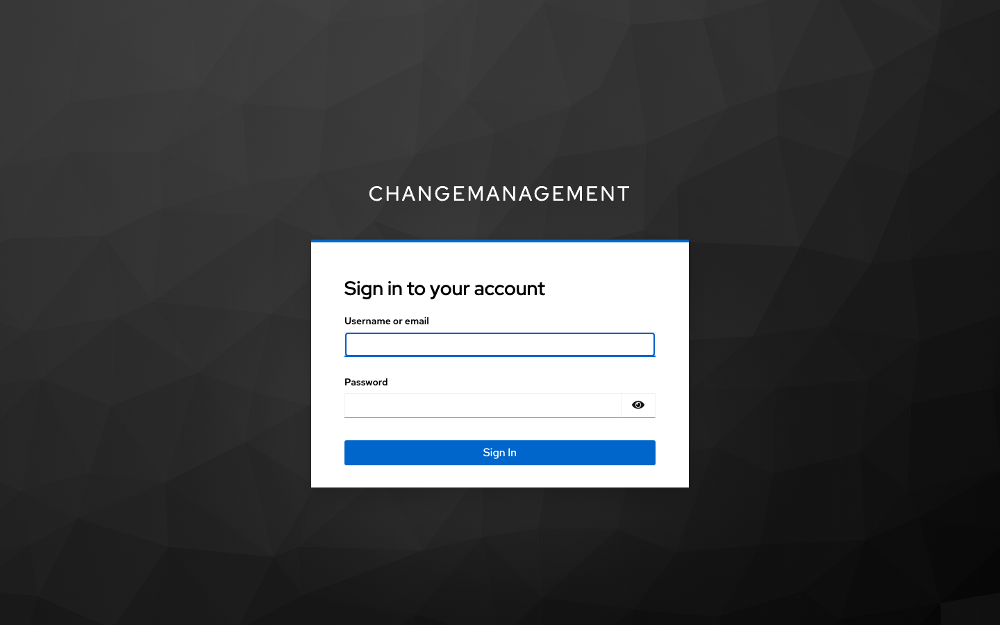
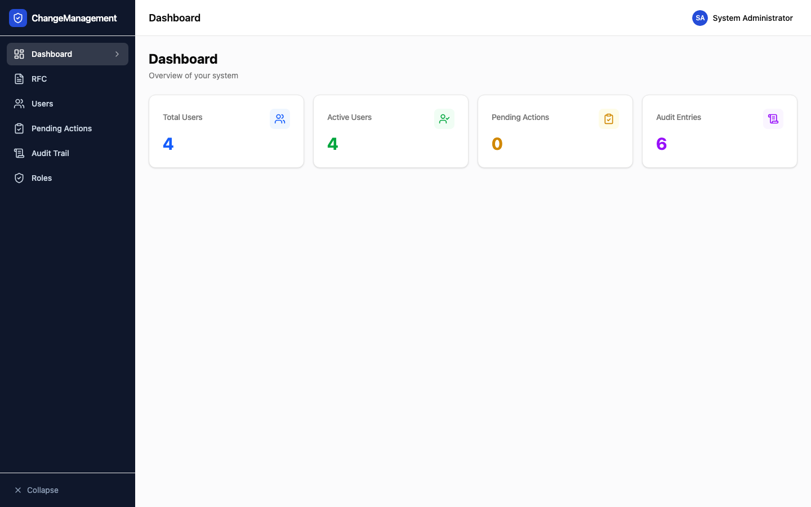
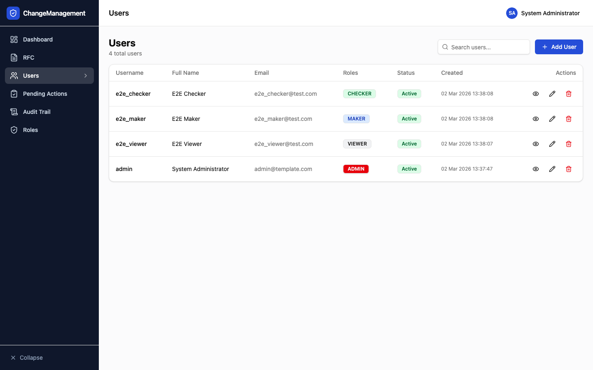
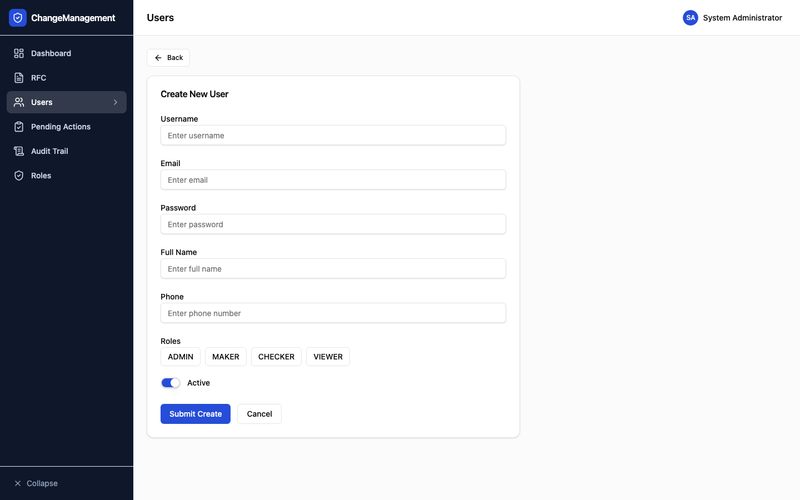
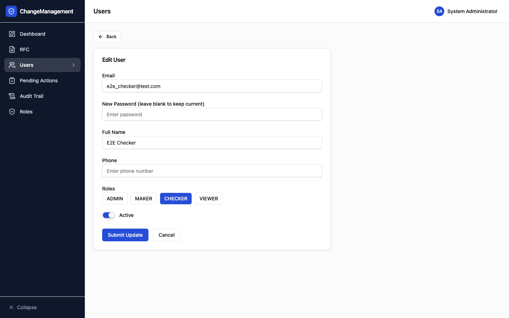
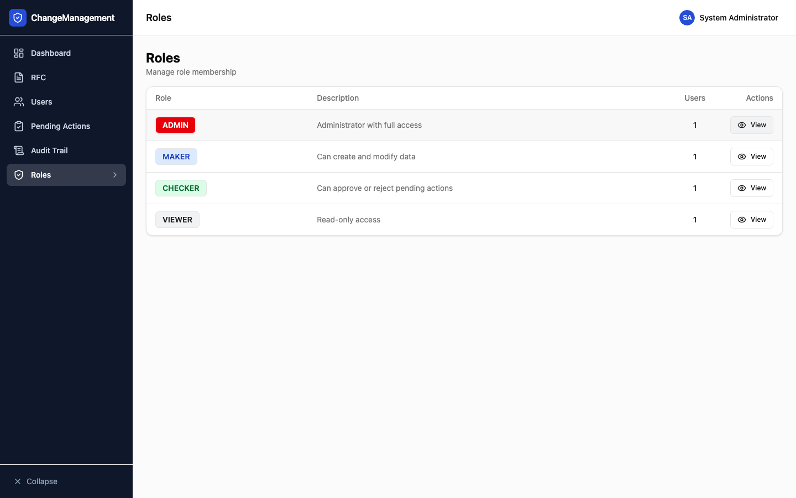
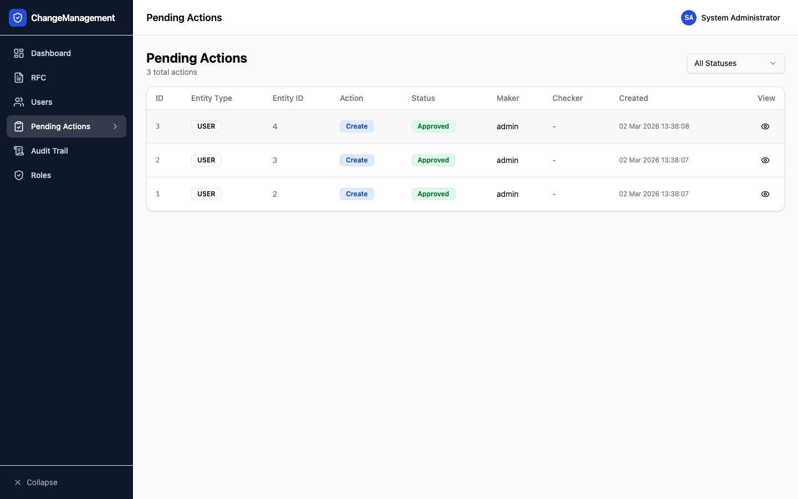
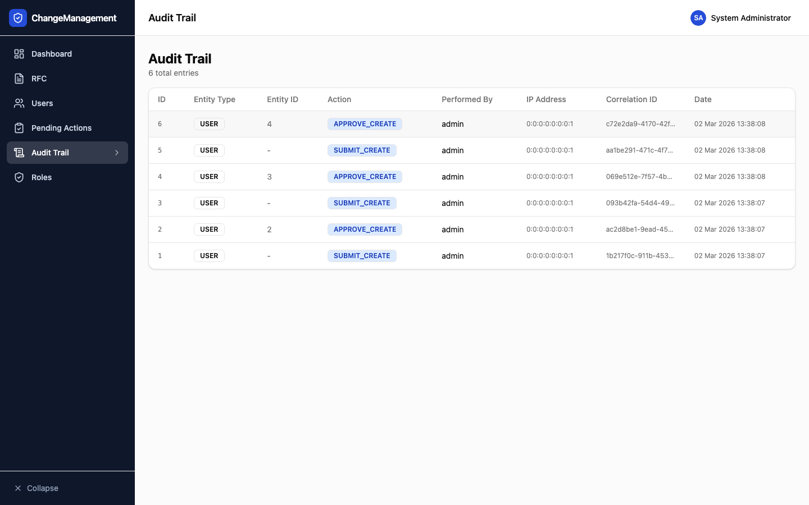
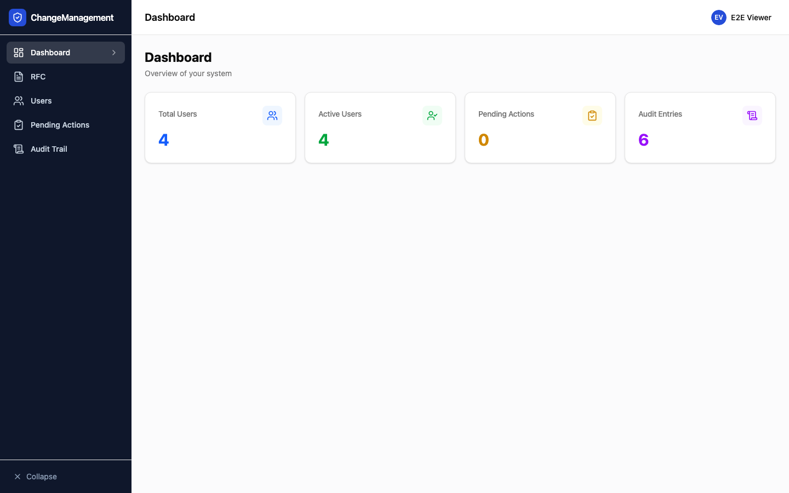

# Panduan Pengguna — Manajemen Distrik

Panduan ini menjelaskan cara menggunakan aplikasi **Manajemen Distrik**, termasuk alur kerja maker-checker, manajemen user, data wilayah, dan audit trail.

---

## Daftar Isi

1. [Login](#1-login)
2. [Dashboard](#2-dashboard)
3. [Manajemen User](#3-manajemen-user)
4. [Role Management](#4-role-management)
5. [Pending Actions (Maker-Checker)](#5-pending-actions-maker-checker)
6. [Audit Trail](#6-audit-trail)
7. [Data Wilayah](#7-data-wilayah)
8. [Settings](#8-settings)
9. [Hak Akses per Role](#9-hak-akses-per-role)

---

## 1. Login

### 1.1 Halaman Login

Buka aplikasi di browser. Anda akan melihat halaman login dengan tombol **Sign In with Keycloak**.



Klik tombol **Sign In with Keycloak** untuk diarahkan ke halaman autentikasi.

---

### 1.2 Halaman Keycloak

Isi **username** dan **password** pada form Keycloak, lalu klik **Sign In**.



> **Catatan:** Akun dikelola oleh Keycloak. Hubungi administrator jika lupa password atau akun belum dibuat.

---

### 1.3 Setelah Login — Dashboard

Setelah berhasil login, Anda langsung diarahkan ke halaman **Dashboard**.



---

## 2. Dashboard

Dashboard menampilkan ringkasan statistik aplikasi: jumlah user aktif, pending actions, dan aktivitas terbaru.


**Elemen Dashboard:**
- **Kartu statistik** — ringkasan total user, pending actions, dan entri audit trail
- **Navigasi sidebar** — akses cepat ke semua modul
- **Header** — menampilkan nama user yang sedang login; klik untuk logout

---

## 3. Manajemen User

> Hanya dapat diakses oleh **ADMIN**.

### 3.1 Daftar User

Navigasi ke menu **User Management** di sidebar untuk melihat seluruh daftar user.



Tabel menampilkan:
- Nama lengkap
- Username
- Email
- Role aktif
- Status akun
- Tombol aksi (Detail / Edit / Hapus)

---

### 3.2 Tambah User Baru

Klik tombol **Tambah User** di bagian atas halaman untuk membuka form.



Isi field yang diperlukan:
- **Nama Lengkap**
- **Username** (unik)
- **Email**
- **Role** — pilih satu atau lebih: ADMIN, MAKER, CHECKER, VIEWER

> **Penting:** Aksi tambah user akan masuk ke antrian **Pending Actions** dan membutuhkan persetujuan dari user lain (alur Maker-Checker).

---

### 3.3 Detail User

Klik tombol **Detail** pada baris user untuk melihat informasi lengkap.



Halaman detail menampilkan semua atribut user beserta riwayat perubahan.

---

## 4. Role Management

> Hanya dapat diakses oleh **ADMIN**.

Navigasi ke menu **Roles** untuk melihat daftar role yang tersedia dan anggotanya.



**Empat role dalam sistem:**

| Role    | Deskripsi |
|---------|-----------|
| ADMIN   | Akses penuh — kelola user, role, settings, dan semua modul |
| MAKER   | Dapat membuat dan mengajukan perubahan data |
| CHECKER | Dapat menyetujui atau menolak pengajuan dari Maker |
| VIEWER  | Hanya dapat melihat data, tidak dapat melakukan perubahan |

---

## 5. Pending Actions (Maker-Checker)

Semua perubahan data (tambah, ubah, hapus) tidak langsung diterapkan ke database. Perubahan tersebut masuk ke antrian **Pending Actions** dan harus disetujui oleh user lain.

### Aturan Maker-Checker:
- **Maker** tidak bisa menyetujui pengajuannya sendiri
- **Checker** atau **Admin** lain yang harus melakukan persetujuan
- Pengecualian: jika hanya ada satu Admin di sistem, admin tersebut dapat menyetujui pengajuannya sendiri *(sole-admin bypass)*

### 5.1 Daftar Pending Actions

Navigasi ke menu **Pending Actions** untuk melihat semua pengajuan yang menunggu persetujuan.



**Kolom yang ditampilkan:**
- Tipe aksi (CREATE / UPDATE / DELETE)
- Entitas yang diubah (User, Wilayah, dll.)
- Dibuat oleh (Maker)
- Waktu pengajuan
- Status (PENDING / APPROVED / REJECTED)
- Tombol Approve / Reject

---

## 6. Audit Trail

Audit Trail merekam seluruh aktivitas yang terjadi di sistem — termasuk siapa yang melakukan perubahan, kapan, dan apa yang berubah.

### 6.1 Daftar Audit Trail

Navigasi ke menu **Audit Trail** untuk melihat riwayat lengkap.



**Informasi yang dicatat:**
- Waktu kejadian
- Tipe aksi
- Entitas yang terpengaruh
- Username Maker (pembuat pengajuan)
- Username Checker (yang menyetujui)
- Data sebelum dan sesudah perubahan

> Audit trail bersifat **read-only** — tidak ada data yang dapat dihapus atau diubah dari antarmuka ini.

---

## 7. Data Wilayah

Modul Wilayah mengelola hierarki wilayah Indonesia: **Provinsi → Kabupaten/Kota → Kecamatan → Kelurahan/Desa**.

### 7.1 Halaman Utama Wilayah

Navigasi ke menu **Wilayah** untuk mengakses modul ini.


Halaman ini memiliki beberapa tab:
- **Provinsi / Kabupaten / Kecamatan / Kelurahan** — CRUD data per level hierarki
- **Inquiry** — pencarian bertingkat (cascading dropdown)
- **Bulk Upload** — import data massal dari file CSV

---

### 7.2 Inquiry Wilayah

Tab **Inquiry** memungkinkan pencarian data wilayah secara bertingkat:
1. Pilih Provinsi
2. Pilih Kabupaten/Kota
3. Pilih Kecamatan
4. Lihat daftar Kelurahan/Desa beserta kode pos

> Inquiry dilindungi rate-limit: **60 request per menit** per user.

---

### 7.3 Bulk Upload

Tab **Bulk Upload** memungkinkan import data wilayah dalam jumlah besar via file CSV.

**Format CSV yang didukung:**
```
ProvinceID,ProvinceName,StateID,StateName,DistrictID,DistrictName,SubDistrictID,SubDistrictName,ZipCode
```

**Proses Bulk Upload:**
1. Upload file CSV
2. Sistem memvalidasi setiap baris
3. Pengajuan masuk ke Pending Actions (butuh persetujuan Checker)
4. Setelah disetujui, data diterapkan dengan logika diff:
   - **Skip** — baris identik dengan data existing
   - **Insert** — data baru
   - **Update** — hanya zipcode yang berubah

---

## 8. Settings

> Hanya dapat diakses oleh **ADMIN**.

Navigasi ke menu **Settings** untuk mengonfigurasi pengaturan aplikasi.


**Pengaturan yang tersedia:**
- Konfigurasi validasi data (Google Custom Search API)
- Pengaturan deteksi data mencurigakan (suspect data)
- Parameter sistem lainnya

---

## 9. Hak Akses per Role

Tabel berikut merangkum akses setiap role terhadap fitur aplikasi:

| Fitur                    | ADMIN | MAKER | CHECKER | VIEWER |
|--------------------------|:-----:|:-----:|:-------:|:------:|
| Dashboard                |  ✅   |  ✅   |   ✅    |   ✅   |
| Lihat User               |  ✅   |  ❌   |   ❌    |   ❌   |
| Tambah / Edit / Hapus User |  ✅  |  ❌   |   ❌    |   ❌   |
| Role Management          |  ✅   |  ❌   |   ❌    |   ❌   |
| Pending Actions (lihat)  |  ✅   |  ✅   |   ✅    |   ❌   |
| Pending Actions (approve)|  ✅   |  ❌   |   ✅    |   ❌   |
| Audit Trail              |  ✅   |  ✅   |   ✅    |   ❌   |
| Data Wilayah (lihat)     |  ✅   |  ✅   |   ✅    |   ✅   |
| Data Wilayah (ubah)      |  ✅   |  ✅   |   ❌    |   ❌   |
| Inquiry Wilayah          |  ✅   |  ✅   |   ✅    |   ✅   |
| Bulk Upload              |  ✅   |  ✅   |   ❌    |   ❌   |
| Settings                 |  ✅   |  ❌   |   ❌    |   ❌   |

---

### Tampilan Viewer

User dengan role **VIEWER** hanya melihat menu yang terbatas — tidak ada tombol tambah, edit, atau hapus.

**Dashboard Viewer:**


**Wilayah Viewer:**



---

## Bantuan & Kontak

Jika mengalami kendala atau memerlukan bantuan, hubungi administrator sistem.

---

*Dokumen ini di-generate otomatis pada saat capture dengan Playwright.*
